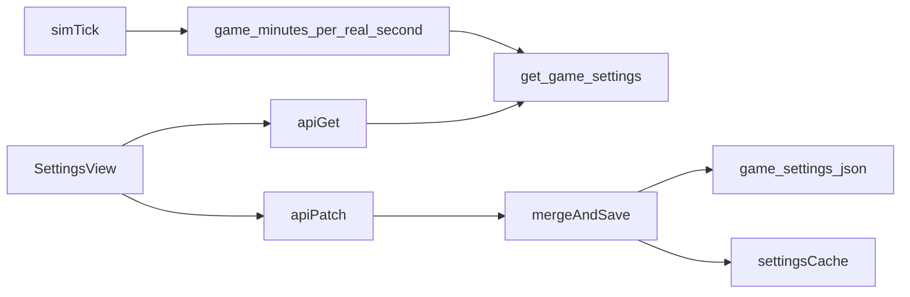

# Editable `day_length_multiplier` in Settings

## Context

- The value lives at `simulation.day_length_multiplier` in [`game_data/config/game_settings.json`](game_data/config/game_settings.json).
- [`backend/src/rts_world/sim/clock.py`](backend/src/rts_world/sim/clock.py) reads it through `get_game_settings()`; values `<= 0` are treated as `1.0`. Base pace is **20 real minutes per full in-game day** at multiplier `1`.
- [`backend/src/rts_world/config.py`](backend/src/rts_world/config.py) caches loaded JSON in `_SETTINGS_CACHE`. **Any write path must clear or replace that cache** (e.g. `get_game_settings(force_reload=True)` after a successful write, or a small `invalidate_game_settings_cache()` helper) so the running sim and [`GET /sim/clock`](backend/src/rts_world/api/main.py) use the new rate immediately.
- The UI pattern to mirror is [`frontend/src/components/SettingsView.tsx`](frontend/src/components/SettingsView.tsx): load on `refreshKey`, show fields, save via API, success/error feedback.

## Scalability (adding more settings later)

**Yes, if the first implementation is generalized on purpose.** A one-off `POST /settings/day-length-multiplier` does not scale: every new knob needs a new route and duplicate wiring.

**Recommended pattern for this project:**

- **Single GET** `/settings/game-settings` — returns the full JSON document (after `force_reload` from disk) so the Settings page is one source of truth and new sections only need UI + validation, not routing churn.
- **Single PATCH** `/settings/game-settings` — body is a **partial** document that is **deep-merged** into the current file (dict + dict merges recursively; scalars/lists replaced when the patch supplies a non-dict value at that path). Unmentioned keys stay unchanged. This matches how [`game_settings.json`](game_data/config/game_settings.json) is structured (`traits`, `simulation`, `balance`, `season_length`, etc.).
- **Validation** grows incrementally: start by validating only what the patch touches (e.g. if `simulation` is present, require `day_length_multiplier > 0` when that key is present). Later, add optional Pydantic models per top-level section or a shared `validate_game_settings_patch(patch, merged)` helper so unsafe combinations are rejected without new HTTP surface area.
- **Frontend**: one `GameSettings` type mirroring the file; each new control is local state + one shared "Save game settings" that sends `{ simulation: { ... }, balance: { ... } }` partials, or section-level save buttons that PATCH the same endpoint with a small payload.

The first deliverable still only **exposes** `day_length_multiplier` in the UI, but the backend contract is already the scalable one.

## Backend

1. **Config module** ([`backend/src/rts_world/config.py`](backend/src/rts_world/config.py))
   - Add **`merge_and_save_game_settings(patch: dict[str, Any]) -> dict[str, Any]`** (name as you prefer) that:
     - Reads the latest JSON from disk (avoid merging against a stale in-memory copy).
     - **Deep-merges** `patch` into that object (document merge rules: two dicts merge key-wise; otherwise the patch value wins).
     - Writes back with stable formatting (`indent=2`, trailing newline).
     - Refreshes `_SETTINGS_CACHE` with the merged result (or invalidates then `force_reload`).
   - Keeps `get_game_settings()` as the read path for the rest of the sim.

2. **API** ([`backend/src/rts_world/api/main.py`](backend/src/rts_world/api/main.py))
   - **GET** `/settings/game-settings`: return merged full settings from disk (`force_reload=True` before respond) so hand-edited files show up.
   - **PATCH** `/settings/game-settings`: accept a JSON object (same shape as the file, partial allowed). Run merge helper, then validate the **merged** result for keys present in the patch (minimum: `simulation.day_length_multiplier` when patched — `Field(gt=0, le=<cap>)`). Return the updated full document or `{ "settings": ..., "real_seconds_per_game_day": ... }` after merge so the client can refresh derived clock hints without an extra round trip.

## Frontend

1. **Types** ([`frontend/src/types.ts`](frontend/src/types.ts)): add a `GameSettings` type (or `Record<string, unknown>` plus narrow helpers) aligned with the JSON file.

2. **Settings UI** ([`frontend/src/components/SettingsView.tsx`](frontend/src/components/SettingsView.tsx)):
   - On load: `apiGet` `/settings/game-settings` (alongside existing clock fetch), seed local state for `day_length_multiplier`.
   - New **Section** (e.g. "Simulation") with day-length hint (20 real minutes baseline × multiplier).
   - **Save** sends `apiPatch` with body `{ "simulation": { "day_length_multiplier": <value> } }`; on success refresh local snapshot from response and call `onClockChanged()` if the response includes clock-derived fields or after a follow-up `GET /sim/clock`.

3. **Styling**: reuse existing classes (`settings-form`, `settings-field`, `settings-save`, `settings-hint`, `settings-success`) from the Realm Time block in [`frontend/src/App.css`](frontend/src/App.css) where needed; only add CSS if something new is required.

## Tests (lightweight)

- Prefer a **unit-style** test that monkeypatches [`GAME_SETTINGS_PATH`](backend/src/rts_world/config.py) to a **temporary file**, writes initial JSON, exercises **merge** (e.g. patch only `simulation` leaves `traits` intact) and cache refresh, optionally FastAPI `TestClient` for GET/PATCH. Postgres not required.

## Data flow (high level)

