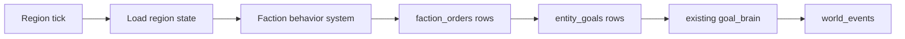

# Initial Faction Behavior Orders With Unified Rank

## Goal

Build the first version of faction behavior as a **region-scoped faction brain** that assigns regular character goals to members. Factions do not get their own executable goal table yet. They decide what member orders to issue, and characters continue to execute through the existing `entity_goals` pipeline.

The key modeling choice: use **rank as the single behavior input** for all faction members. House-specific labels like `patriarch`, `matriarch`, `heir`, and `scion` should be treated as house ranks, not as a separate higher-priority `role` concept.

## 1. Normalize Membership Rank Semantics

- Keep the existing house membership table for now because it enforces “one house per entity,” but treat `entity_houses.role` as the house member’s **rank** in simulation code and API/UI labels.
- Avoid separate “role beats rank” behavior logic. Instead, load a unified member record with fields like:
  - `entity_id`
  - `faction_id`
  - `source`: `house` or `faction`
  - `rank`: from `entity_houses.role` for houses, from `entity_factions.rank` for other factions
  - `rank_bucket`: derived from rank
- Optional later cleanup: rename `entity_houses.role` to `rank`, but do not require that migration for the initial behavior system.

## 2. Add Persistent Order State

- Add a lightweight `faction_orders` table in [`backend/src/rts_world/db/schema.sql`](backend/src/rts_world/db/schema.sql).
- Use it as a ledger/cooldown source for commands issued by faction behavior, not as an executor.
- Suggested fields:
  - `id BIGSERIAL PRIMARY KEY`
  - `faction_id INT NOT NULL REFERENCES factions(id) ON DELETE CASCADE`
  - `entity_id INT REFERENCES entities(id) ON DELETE SET NULL`
  - `region_id INT REFERENCES regions(id) ON DELETE SET NULL`
  - `order_type TEXT NOT NULL`
  - `status TEXT NOT NULL DEFAULT 'active'`
  - `payload JSONB NOT NULL DEFAULT '{}'::jsonb`
  - `created_at_game_tick BIGINT`
  - `completed_at_game_tick BIGINT`
  - timestamps
- Initial statuses: `active`, `completed`, `cancelled`, `failed`.
- Add indexes for active order lookup by `faction_id`, `entity_id`, `region_id`, and `status`.

## 3. Extend RegionState Loading

- Extend [`backend/src/rts_world/sim/state.py`](backend/src/rts_world/sim/state.py) with:
  - loaded factions and `factions_by_id`
  - loaded `region_control` rows for the ticked region and unpaused descendants
  - unified member rows grouped by `faction_id`
  - `faction_orders`
  - dirty/new order tracking
- Extend [`backend/src/rts_world/sim/regions.py`](backend/src/rts_world/sim/regions.py) `load_region_state()` to load:
  - factions that own/control the ticked region or descendants
  - house members through `entity_houses`, projecting `entity_houses.role AS rank`
  - non-house members through `entity_factions`, projecting `entity_factions.rank AS rank`
  - active/recent `faction_orders` for those factions/regions
- Extend `write_region_state()` to insert new faction orders and update dirty order statuses.

## 4. Add Rank Bucketing

- Add a small pure helper in the new faction behavior module, not a database table yet.
- Example buckets:
  - `leader`: `patriarch`, `matriarch`, `lord`, `lady`, `master`, `archmage`
  - `heir`: `heir`
  - `elite`: `champion`, `knight`, `officer`, `elite`
  - `council`: `councilor`, `advisor`, `minister`
  - `member`: `member`, `scion`, `student`, fallback
- Store both the raw `rank` and derived `rank_bucket` in `faction_orders.payload` when issuing an order.

## 5. Add Faction Behavior System

- Add a new system module, e.g. [`backend/src/rts_world/sim/systems/factions.py`](backend/src/rts_world/sim/systems/factions.py).
- Register it in [`backend/src/rts_world/sim/systems/__init__.py`](backend/src/rts_world/sim/systems/__init__.py) before `goal_brain`, so newly issued entity goals can be considered in the same tick where appropriate.
- Initial behavior should be conservative and deterministic:
  - For each faction controlling/owning the current region, inspect eligible members in the loaded region scope.
  - Skip if an equivalent active order already exists.
  - Pick members by `rank_bucket`, current location, and lack of conflicting active goals.
  - Issue a small number of orders per tick to avoid spam.

## 6. Initial Behavior Rules

Start with simple rule functions rather than a generic behavior tree framework.

- **Controlled border patrol**:
  - Applies to factions that control a region with border subregions.
  - Prefer `member` or `elite` buckets.
  - Create a `faction_order` like `patrol_region` and an entity `travel_to_region` goal to the border subregion.
- **Keep controller presence**:
  - Applies to castle/keep regions controlled by a faction.
  - Prefer `elite`, then `member`.
  - Create a `station_at_region` or `inspect_region` order and an entity `travel_to_region` goal.

Keep leaders/council mostly out of v1 execution unless a rule specifically needs them.

## 7. Link Orders to Entity Goals

- When the behavior system issues an entity goal, include order metadata in goal payload:
  - `source_type: "faction_order"`
  - `source_key` or `source_order_id`
  - `faction_id`
  - `order_type`
- In v1, use a stable `source_key` if both the order and goal are inserted during the same write pass. A later migration can add a strict `entity_goal_id` FK if needed.
- Reuse the existing `entity_goals` writeback path in [`backend/src/rts_world/sim/regions.py`](backend/src/rts_world/sim/regions.py).

## 8. API and UI Visibility

- Extend faction detail in [`backend/src/rts_world/api/main.py`](backend/src/rts_world/api/main.py) to return recent/active `faction_orders`.
- Extend [`frontend/src/types.ts`](frontend/src/types.ts) with `FactionOrder`.
- Add a read-only “Orders” section to [`frontend/src/components/FactionsView.tsx`](frontend/src/components/FactionsView.tsx): order type, member, region, rank, rank bucket, status, created tick.
- Update any house-member UI copy over time from “Role” toward “Rank” for consistency, but keep this separate if it would expand the initial implementation too much.

## 9. Tests

- Add pure-system tests similar to [`tests/test_goal_system.py`](tests/test_goal_system.py):
  - house `entity_houses.role` is loaded/projected as unified `rank`
  - rank bucket helper maps `heir`, `scion`, and generic ranks predictably
  - no duplicate order when an active equivalent order exists
  - controlled-region rule issues a travel goal to an eligible member
- Add load/write tests only if the current DB fixtures make it cheap; otherwise keep v1 focused on pure `RegionState` behavior.

## Not In V1

- Full behavior tree authoring format.
- First-class `faction_goals` executor/table.
- Renaming `entity_houses.role` to `rank` at the DB level.
- War, diplomacy, claims, influence math.
- Complex resource accounting.
- Manual order creation UI.

## Implementation Order

1. Add `faction_orders` schema and indexes.
2. Extend `RegionState` and region load/write for faction control, unified members, and orders.
3. Add rank bucketing helper and initial faction behavior system.
4. Register the system before `goal_brain`.
5. Expose read-only orders in API/UI.
6. Add focused tests and run backend/frontend checks.